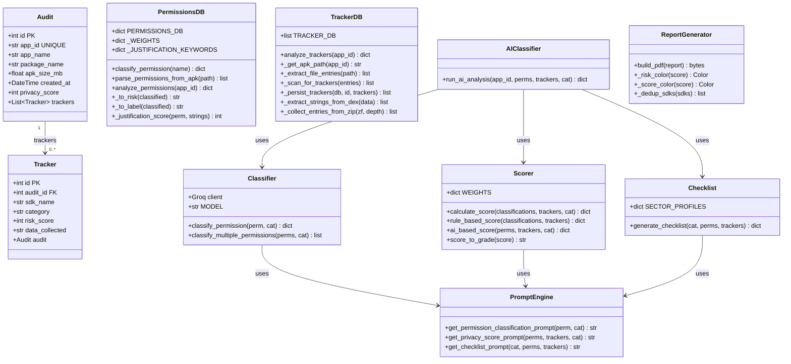
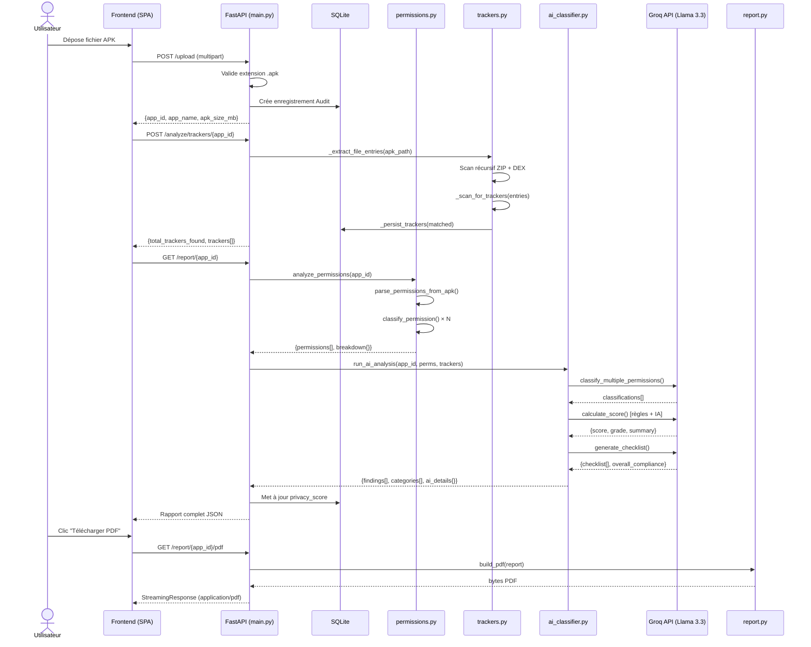

# RAPPORT TECHNIQUE COMPLET
## Privacy Posture Analyzer

**Date du rapport :** 17 mai 2026  
**Répertoire analysé :** `C:\Users\HP\Downloads\project\project`  
**Auteur de l'analyse :** Claude Code (claude-sonnet-4-6)

---

## 1. VUE D'ENSEMBLE DU PROJET

### Nom et objectif
**Privacy Posture Analyzer** — Outil d'audit de la confidentialité des applications Android. Il analyse statiquement les fichiers APK pour détecter les permissions déclarées, les SDKs tiers embarqués, évaluer la conformité RGPD et produire un score de confidentialité de 0 à 100 accompagné d'un rapport PDF professionnel.

### Type de projet
Application **web full-stack** composée de :
- Un **backend REST API** (Python/FastAPI)
- Un **frontend SPA** (HTML5 + JavaScript vanilla)
- Un **moteur d'IA** intégré (Groq / Llama 3.3 70B)
- Un **module de génération de rapports PDF** (ReportLab)

### Langages et frameworks

| Composant | Technologie |
|---|---|
| Backend | Python 3.12+, FastAPI 0.111.0 |
| ORM | SQLAlchemy 2.0.49 |
| Base de données | SQLite (fichier local) |
| Serveur ASGI | Uvicorn 0.29.0 |
| IA | Groq API — modèle `llama-3.3-70b-versatile` |
| PDF | ReportLab |
| Frontend | HTML5, CSS3, JavaScript ES6 (vanilla) |
| Tests | pytest |

---

## 2. STRUCTURE & ARCHITECTURE

### Arbre complet des dossiers

```
project/
│
├── Privacy_Posture_Analyzer.html       # Frontend SPA (point d'entrée utilisateur)
├── README.md                           # Documentation de démarrage rapide
├── theoretical_summary.docx            # Rapport théorique du projet
├── RAPPORT_TECHNIQUE.md                # Ce fichier
│
├── pdfforge1_source/
│   └── Privacy Posture Analyzer.html   # Variante HTML du rapport (exportée)
│
└── backend/                            # Cœur applicatif Python
    ├── main.py                         # App FastAPI — routeur principal, tous les endpoints
    ├── database.py                     # Connexion SQLite + SessionLocal
    ├── models.py                       # Modèles ORM SQLAlchemy (Audit, Tracker)
    ├── requirements.txt                # Dépendances Python
    ├── .env                            # [CRITIQUE] Clés API en clair
    ├── privacy_analyzer.db             # Fichier SQLite (commité dans le dépôt)
    │
    ├── uploads/                        # Stockage des APKs téléversés
    │
    ├── modules/                        # Modules fonctionnels (1 membre = 1 module)
    │   ├── __init__.py
    │   ├── permissions.py              # Membre 1 — Analyse des permissions
    │   ├── trackers.py                 # Membre 2 — Détection SDKs/trackers
    │   ├── report.py                   # Membre 3 — Génération rapport PDF
    │   ├── ai_classifier.py            # Membre 4 — Orchestrateur IA
    │   ├── classifier.py               # Membre 4 — Classification Llama
    │   ├── scorer.py                   # Membre 4 — Calcul du score
    │   ├── checklist.py                # Membre 4 — Checklist RGPD
    │   ├── prompt_engine.py            # Membre 4 — Ingénierie des prompts
    │   │
    │   └── tests/
    │       └── test_trackers.py        # Tests unitaires du module trackers
    │
    └── tests/
        ├── test_ai_engine.py           # Tests unitaires du moteur IA (12 tests)
        └── test_permissions.py         # Tests unitaires des permissions (10 tests)
```

### Pattern architectural

L'architecture suit un **pattern en couches (Layered Architecture)** :

```
┌─────────────────────────────────────────────┐
│           COUCHE PRÉSENTATION               │
│     Privacy_Posture_Analyzer.html (SPA)     │
│     Drag & Drop APK → Dashboard résultats   │
└──────────────────┬──────────────────────────┘
                   │ HTTP REST (JSON)
┌──────────────────▼──────────────────────────┐
│           COUCHE API (FastAPI)              │
│     main.py — Routes, validation, CORS     │
└──────────────────┬──────────────────────────┘
                   │
┌──────────────────▼──────────────────────────┐
│        COUCHE LOGIQUE MÉTIER                │
│  ┌──────────┐ ┌──────────┐ ┌────────────┐  │
│  │permissions│ │ trackers │ │ ai_engine  │  │
│  └──────────┘ └──────────┘ └────────────┘  │
│               ┌──────────┐                 │
│               │  report  │                 │
│               └──────────┘                 │
└──────────────────┬──────────────────────────┘
                   │
┌──────────────────▼──────────────────────────┐
│           COUCHE DONNÉES                   │
│  SQLAlchemy ORM → SQLite (privacy.db)      │
│  Stockage fichiers : uploads/*.apk         │
└─────────────────────────────────────────────┘
```

### Modules fonctionnels identifiés

| Module | Membre | Responsabilité |
|---|---|---|
| `permissions.py` | Membre 1 | Parser AXML binaire, classification 60+ permissions |
| `trackers.py` | Membre 2 | Scan récursif APK/DEX, base de 35 SDKs connus |
| `report.py` | Membre 3 | Génération PDF professionnel multi-section |
| `ai_classifier.py` + sous-modules | Membre 4 | Orchestration IA : classification, scoring, checklist |

---

## 3. DIAGRAMMES UML

### 3.1 Diagramme de classes



### 3.2 Diagramme de cas d'utilisation

```
┌─────────────────────────────────────────────────────────┐
│              PRIVACY POSTURE ANALYZER                   │
│                                                         │
│  ┌──────────┐    ── Téléverser un APK                  │
│  │          │    ── Analyser les permissions            │
│  │Analyste  │    ── Détecter les trackers/SDKs          │
│  │Sécurité /│    ── Obtenir le score de confidentialité │
│  │Développeur    ── Générer rapport PDF                 │
│  │          │    ── Consulter l'historique des audits   │
│  └──────────┘    ── Supprimer un audit                  │
│                  ── Obtenir l'analyse IA détaillée      │
│                                                         │
└─────────────────────────────────────────────────────────┘
```

### 3.3 Diagramme de séquence — Flux principal (upload + analyse complète)



### 3.4 Diagramme de composants

```
┌──────────────────────────────────────────────────────────────┐
│                       BACKEND PYTHON                        │
│                                                              │
│  ┌─────────────┐     ┌──────────────────────────────────┐   │
│  │  main.py    │────▶│         modules/                 │   │
│  │  (FastAPI)  │     │  ┌────────────┐ ┌─────────────┐  │   │
│  │  /upload    │     │  │permissions │ │  trackers   │  │   │
│  │  /analyze/* │     │  │  .py       │ │    .py      │  │   │
│  │  /report/*  │     │  └────────────┘ └─────────────┘  │   │
│  │  /history   │     │  ┌────────────┐ ┌─────────────┐  │   │
│  │  /audit/*   │     │  │  report    │ │ ai_classifier│ │   │
│  └──────┬──────┘     │  │   .py      │ │     .py     │  │   │
│         │            │  └────────────┘ └──────┬──────┘  │   │
│  ┌──────▼──────┐     │                        │         │   │
│  │ database.py │     │         ┌──────────────▼──────┐  │   │
│  │ SQLAlchemy  │     │         │  classifier.py       │  │   │
│  │ SQLite      │     │         │  scorer.py           │  │   │
│  └─────────────┘     │         │  checklist.py        │  │   │
│                      │         │  prompt_engine.py    │  │   │
│  ┌─────────────┐     │         └─────────────────────-┘  │   │
│  │  models.py  │     └──────────────────────────────────┘   │
│  │  Audit      │                        │                    │
│  │  Tracker    │                        │ HTTP (Groq API)    │
│  └─────────────┘                        ▼                    │
└─────────────────────────────────────────────────────────────┘
                                   ┌─────────────────┐
                                   │  Groq Cloud     │
                                   │  Llama-3.3-70B  │
                                   └─────────────────┘
```

### 3.5 Diagramme ER (Entité-Relation)

```
┌──────────────────────────────┐        ┌──────────────────────────────┐
│            AUDITS            │        │           TRACKERS           │
├──────────────────────────────┤        ├──────────────────────────────┤
│ PK  id          INTEGER      │        │ PK  id          INTEGER      │
│     app_id      VARCHAR UNIQ │        │ FK  audit_id    INTEGER      │
│     app_name    VARCHAR       │◄──1:N──│     sdk_name    VARCHAR      │
│     package_name VARCHAR      │        │     category    VARCHAR      │
│     apk_size_mb FLOAT        │        │     risk_score  INTEGER      │
│     created_at  DATETIME     │        │     data_collected VARCHAR   │
│     privacy_score INTEGER    │        └──────────────────────────────┘
└──────────────────────────────┘
```

---

## 4. FONCTIONNALITÉS DÉTAILLÉES

### Liste complète des fonctionnalités implémentées

| # | Fonctionnalité | Module | Statut |
|---|---|---|---|
| 1 | Téléversement de fichier APK | `main.py` | ✅ Implémenté |
| 2 | Parsing binaire AndroidManifest.xml (sans librairie externe) | `permissions.py` | ✅ Implémenté |
| 3 | Classification de 60+ permissions Android | `permissions.py` | ✅ Implémenté |
| 4 | Score de justification logarithmique par mots-clés | `permissions.py` | ✅ Implémenté |
| 5 | Détection de 35 SDKs/trackers connus par scan récursif | `trackers.py` | ✅ Implémenté |
| 6 | Scan des fichiers DEX binaires pour SDKs obfusqués | `trackers.py` | ✅ Implémenté |
| 7 | Classification IA des permissions (Llama 3.3) | `classifier.py` | ✅ Implémenté |
| 8 | Score de confidentialité hybride (règles + IA) | `scorer.py` | ✅ Implémenté |
| 9 | Checklist de conformité RGPD par secteur | `checklist.py` | ✅ Implémenté |
| 10 | Génération de rapport PDF professionnel | `report.py` | ✅ Implémenté |
| 11 | Historique des audits | `main.py` | ✅ Implémenté |
| 12 | Suppression d'un audit (+ APK) | `main.py` | ✅ Implémenté |
| 13 | Détection de la catégorie de l'app (health/gaming) | `main.py` | ⚠️ Partiel |
| 14 | Persistance des permissions dans la DB | `models.py` | ❌ Non implémenté |
| 15 | Endpoint de détails IA enrichis | `main.py` | ✅ Implémenté |

### Détail de chaque fonctionnalité principale

#### F1 — Téléversement APK (`POST /upload`)
- Validation extension `.apk` uniquement
- Sanitisation du nom en `app_id` via regex `[^A-Za-z0-9_\-]` → `_`
- Stockage dans `uploads/{app_id}.apk`
- Création d'un enregistrement `Audit` en base (idempotent si déjà existant)
- Retourne : `{app_id, app_name, package, apk_size_mb, message}`

#### F2 — Analyse des permissions (`POST /analyze/permissions/{app_id}`)
- Parcourt le manifest binaire en UTF-16 LE et UTF-8
- Regex `android\.permission\.[A-Z_]+`
- Classifie chaque permission : niveau (normal/dangerous/special) + impact (Low/Medium/High)
- Calcul du label final : **Necessary / Optional / Excessive**
- Downgrade si score de justification ≥ 70 (Excessive → Optional)

#### F3 — Détection des trackers (`POST /analyze/trackers/{app_id}`)
- Scan récursif jusqu'à 3 niveaux d'archives imbriquées (APK, XAPK, JAR, AAR)
- Extraction de chaînes depuis les DEX binaires (patterns `Lcom/foo/...;`)
- Match contre 35 signatures de SDKs connus
- Déduplication par nom de SDK
- Persistence en base avec `audit_id`

#### F4 — Score de confidentialité (`GET /report/{app_id}`)
- Score hybride : `(sdk_privacy × 0.5) + (perm_score × 0.3) + (gdpr_score × 0.2)`
- `sdk_privacy = max(0, 100 - avg_sdk_risk_score)`
- `perm_score` fixe à 80 (dette technique — non dynamique)
- `gdpr_score = max(0, sdk_privacy - 5)`

#### F5 — Score IA (`POST /analyze/ai/{app_id}`)
- Système de pénalités rule-based : EXCESSIVE+CRITICAL = -12, EXCESSIVE+HIGH = -8, tracker = -5, GDPR flag = -3
- Score IA contextuel via Llama sur 5 axes : dangerous_permissions, advertising_sdks, analytics_trackers, permission_mismatch, data_minimisation
- Moyenne des deux scores pour le résultat final

#### F6 — Génération PDF (`GET /report/{app_id}/pdf`)
- Rapport multi-sections : en-tête, score, breakdown, permissions, SDKs, findings, checklist RGPD, catégories de données
- Format A4, marges 18mm, palette couleurs Olive/Stone/Terracotta
- Streamed directement en mémoire (pas de fichier temporaire sur disque)

#### F7 — Checklist RGPD sectorielle
- 5 profils sectoriels : health (GDPR+HIPAA), education (GDPR+COPPA), ecommerce (GDPR+PCI-DSS), gaming (GDPR), flashlight (GDPR)
- 8 à 12 items générés par Llama, mappés sur des articles RGPD réels
- Statut par item : PASS / FAIL / REVIEW

---

## 5. MODÈLE DE DONNÉES

### Entité `Audit`

| Attribut | Type SQL | Contraintes | Description |
|---|---|---|---|
| `id` | INTEGER | PK, auto-increment | Identifiant interne |
| `app_id` | VARCHAR | UNIQUE, NOT NULL, INDEX | Nom sanitisé du fichier APK |
| `app_name` | VARCHAR | nullable | Nom original du fichier |
| `package_name` | VARCHAR | nullable | Package Android (= app_id actuellement) |
| `apk_size_mb` | FLOAT | nullable | Taille en mégaoctets |
| `created_at` | DATETIME | default = now() | Horodatage création |
| `privacy_score` | INTEGER | nullable | Score 0-100 calculé après analyse |

### Entité `Tracker`

| Attribut | Type SQL | Contraintes | Description |
|---|---|---|---|
| `id` | INTEGER | PK, auto-increment | Identifiant interne |
| `audit_id` | INTEGER | FK(audits.id), NOT NULL | Lien vers l'audit parent |
| `sdk_name` | VARCHAR | NOT NULL | Nom du SDK détecté |
| `category` | VARCHAR | NOT NULL | Catégorie (Advertising, Analytics, Social, Crash, Payment) |
| `risk_score` | INTEGER | NOT NULL | Score de risque 30-88 |
| `data_collected` | VARCHAR | nullable | Description des données collectées |

### Relations
- `Audit` ↔ `Tracker` : **One-to-Many** (1 audit peut avoir 0..N trackers)
- Cascade de suppression manuelle dans `DELETE /audit/{app_id}` (pas de cascade SQL déclarée)

### Base de données trackers intégrée (35 SDKs)

| SDK | Catégorie | Score risque |
|---|---|---|
| TikTok SDK | Advertising | 88 |
| ByteDance SDK | Advertising | 88 |
| Meta Audience Network | Advertising | 85 |
| AppLovin | Advertising | 82 |
| Facebook SDK | Social | 80 |
| AdMob | Advertising | 80 |
| IronSource | Advertising | 78 |
| MoPub | Advertising | 76 |
| Adjust | Analytics | 75 |
| AppsFlyer | Analytics | 75 |
| Chartboost | Advertising | 72 |
| Vungle | Advertising | 72 |
| Kochava | Analytics | 72 |
| Twitter SDK | Social | 70 |
| Singular | Analytics | 70 |
| Unity Ads | Advertising | 70 |
| Snap SDK | Social | 68 |
| Branch | Analytics | 65 |
| Segment | Analytics | 65 |
| Braze | Analytics | 62 |
| Firebase Analytics | Analytics | 60 |
| Mixpanel | Analytics | 60 |
| Amplitude | Analytics | 60 |
| Firebase (General) | Analytics | 58 |
| Google Analytics (Legacy) | Analytics | 58 |
| Intercom | Analytics | 58 |
| Stripe | Payment | 55 |
| OneSignal | Analytics | 55 |
| Google Data Transport | Analytics | 55 |
| Spotify SDK | Analytics | 50 |
| Google Play Services | Analytics | 45 |
| Datadog | Crash | 35 |
| New Relic | Crash | 35 |
| App Center (Microsoft) | Crash | 32 |
| Crashlytics | Crash | 30 |
| Bugsnag | Crash | 30 |

---

## 6. API & ROUTES

### Tableau complet des endpoints

| Méthode | Chemin | Module | Description |
|---|---|---|---|
| `GET` | `/` | main.py | Health check |
| `GET` | `/app` | main.py | Sert le frontend HTML |
| `POST` | `/upload` | main.py | Téléversement APK |
| `POST` | `/analyze/trackers/{app_id}` | trackers.py | Détection SDKs/trackers |
| `POST` | `/analyze/permissions/{app_id}` | permissions.py | Analyse permissions |
| `POST` | `/analyze/ai/{app_id}` | ai_classifier.py | Analyse IA Llama |
| `GET` | `/report/{app_id}` | main.py | Rapport JSON complet |
| `GET` | `/report/{app_id}/pdf` | report.py | Téléchargement PDF |
| `GET` | `/report/{app_id}/ai-details` | ai_classifier.py | Détails IA enrichis |
| `GET` | `/history` | main.py | Historique des audits |
| `DELETE` | `/audit/{app_id}` | main.py | Suppression audit + APK |

### Détail des paramètres et réponses

#### `POST /upload`
```
Input  : multipart/form-data — file: *.apk
Output : {
    "app_id": "string",
    "app_name": "string",
    "package": "string",
    "apk_size_mb": float,
    "message": "APK uploaded successfully."
}
Erreurs: 400 si extension != .apk
```

#### `POST /analyze/trackers/{app_id}`
```
Input  : path param app_id
Output : {
    "app_id": "string",
    "total_trackers_found": int,
    "trackers": [
        {"id", "audit_id", "sdk_name", "category", "risk_score", "data_collected"}
    ]
}
Erreurs: 404 si audit ou APK introuvable, 422 si APK corrompu
```

#### `GET /report/{app_id}`
```
Output : {
    "app_id": "string",
    "name": "string",
    "pkg": "string",
    "version": "—",
    "sdkVersion": "Android",
    "size": "X MB",
    "category": "Mobile Application",
    "score": int (0-100),
    "sdks": [{"name", "version", "risk", "score"}],
    "permissions": [{"name", "risk", "label"}],
    "breakdown": {
        "permissions": int,
        "sdks": int,
        "gdpr": int,
        "necessary": int,
        "optional": int,
        "excessive": int
    },
    "categories": [{"cat", "risk", "amount", "desc"}],
    "findings": [{"kind", "title", "desc"}]
}
Erreurs: 404 si app_id inconnu
```

#### `GET /report/{app_id}/pdf`
```
Output : StreamingResponse (application/pdf)
Headers: Content-Disposition: attachment; filename="{app_id}_privacy_report.pdf"
```

#### `GET /history`
```
Output : {
    "audits": [
        {"app_id", "app_name", "package", "score", "date"}
    ]
}
```

#### `DELETE /audit/{app_id}`
```
Output : {"ok": true}
Effets : Supprime les Trackers liés, l'Audit, et le fichier APK sur disque
Erreurs: 404 si app_id inconnu
```

### Middlewares appliqués

| Middleware | Configuration |
|---|---|
| `CORSMiddleware` | `allow_origins=["*"]`, `allow_credentials=True`, `allow_methods=["*"]`, `allow_headers=["*"]` |

Pas de rate limiting, pas d'authentification.

---

## 7. AUTHENTIFICATION & SÉCURITÉ

### Mécanisme d'authentification
**Aucun** — L'application ne dispose d'aucun système d'authentification. L'accès à tous les endpoints est libre et public.

### Gestion des rôles et permissions
**Aucune** — Pas de système de rôles.

### Tableau des protections

| Protection | Présence | Détail |
|---|---|---|
| CORS | ✅ Présent | `allow_origins=["*"]` — trop permissif |
| CSRF | ❌ Absent | Pas de protection |
| Rate limiting | ❌ Absent | Risque DoS |
| Authentification | ❌ Absent | API ouverte |
| Validation MIME | ⚠️ Partielle | Extension `.apk` uniquement (pas de magic bytes) |
| Taille maximale upload | ❌ Absent | Pas de limite |
| Injection SQL | ✅ Protégé | SQLAlchemy ORM avec requêtes paramétrées |
| XSS | N/A | Pas de rendu HTML dynamique côté serveur |
| Secrets | ❌ **CRITIQUE** | Clés API exposées dans `.env` commité |

### Problèmes critiques de sécurité

> **[CRITIQUE] Clés API exposées dans `.env`**
>
> Le fichier `.env` contient des clés d'API en clair et est présent dans le dépôt Git.
> Ces clés doivent être considérées comme **compromises** et révoquées immédiatement sur les dashboards Groq et Google Cloud.

> **[CRITIQUE] Fichier `privacy_analyzer.db` commité**
>
> La base de données SQLite est versionnée, ce qui expose les données d'audit passées.

> **[HAUTE] Pas de `.gitignore`**
>
> L'absence de `.gitignore` explique pourquoi `.env` et `.db` ont été commités.

### Recommandations sécurité prioritaires

1. Révoquer et régénérer immédiatement les clés Groq et Gemini
2. Créer un `.gitignore` avec au minimum : `.env`, `*.db`, `uploads/`, `__pycache__/`, `.pytest_cache/`
3. Utiliser des variables d'environnement système ou un gestionnaire de secrets (Vault, AWS Secrets Manager)
4. Restreindre CORS aux origines connues
5. Ajouter une validation par magic bytes pour les uploads APK (signature ZIP `PK\x03\x04`)
6. Ajouter une limite de taille d'upload (ex: 100 MB maximum)

---

## 8. DÉPENDANCES & LIBRAIRIES

### `requirements.txt` — Dépendances déclarées

| Package | Version | Rôle | Type |
|---|---|---|---|
| `fastapi` | 0.111.0 | Framework web API REST | Production |
| `uvicorn[standard]` | 0.29.0 | Serveur ASGI pour FastAPI | Production |
| `sqlalchemy` | 2.0.49 | ORM pour SQLite | Production |
| `python-multipart` | 0.0.9 | Parsing multipart/form-data (upload) | Production |

### Dépendances non déclarées (utilisées dans le code)

| Package | Utilisé dans | Rôle | Type |
|---|---|---|---|
| `groq` | `classifier.py`, `scorer.py`, `checklist.py` | Client API Groq / Llama 3.3 | Production |
| `python-dotenv` | `classifier.py`, `scorer.py`, `checklist.py` | Chargement variables `.env` | Production |
| `reportlab` | `report.py` | Génération de PDF (tableaux, graphiques, mise en page A4) | Production |
| `pytest` | `tests/*.py` | Framework de tests | Développement |

> **Problème :** `groq`, `python-dotenv` et `reportlab` sont **absents de `requirements.txt`**. L'application ne peut pas fonctionner sans les installer manuellement. Un `pip install -r requirements.txt` brut échouera à l'exécution.

### `requirements.txt` corrigé (suggéré)

```txt
fastapi==0.111.0
uvicorn[standard]==0.29.0
sqlalchemy==2.0.49
python-multipart==0.0.9
groq>=0.9.0
python-dotenv>=1.0.0
reportlab>=4.0.0
pytest>=7.0.0
```

---

## 9. CONFIGURATION & ENVIRONNEMENT

### Fichiers de configuration présents

| Fichier | Rôle |
|---|---|
| `backend/.env` | Clés API (GEMINI_API_KEY, GROQ_API_KEY) |
| `.claude/settings.local.json` | Configuration de l'environnement Claude Code (allowlist bash) |

### Variables d'environnement requises

| Variable | Requis | Description |
|---|---|---|
| `GROQ_API_KEY` | **Obligatoire** | Accès à l'API Groq/Llama pour tous les modules IA |
| `GEMINI_API_KEY` | Non utilisée | Reliquat d'une version précédente (Gemini remplacé par Groq) |

### Constantes de configuration dans le code

| Paramètre | Valeur hardcodée | Fichier |
|---|---|---|
| URL base de données | `sqlite:///./privacy_analyzer.db` | `database.py` |
| Dossier uploads | `uploads/` | `main.py`, `trackers.py`, `permissions.py` |
| Modèle IA | `llama-3.3-70b-versatile` | `classifier.py`, `scorer.py`, `checklist.py` |
| Température IA (classification) | `0.2` | `classifier.py` |
| Température IA (scoring) | `0.2` | `scorer.py` |
| Température IA (checklist) | `0.2` | `checklist.py` |
| Max tokens (classification) | `500` | `classifier.py` |
| Max tokens (scoring) | `600` | `scorer.py` |
| Max tokens (checklist) | `1500` | `checklist.py` |
| Profondeur max scan ZIP | `3` niveaux | `trackers.py` |
| Score permissions fixe | `80` | `main.py` |
| Seuil justification downgrade | `70` | `permissions.py` |

### Environnements
Pas de distinction `dev/staging/production`. Un seul environnement. Pas de Docker, pas de CI/CD, pas de configuration par environnement.

---

## 10. BASE DE DONNÉES & PERSISTANCE

### Type et configuration

| Paramètre | Valeur |
|---|---|
| Type | SQLite (base embarquée, fichier unique) |
| Fichier | `backend/privacy_analyzer.db` |
| URL de connexion | `sqlite:///./privacy_analyzer.db` |
| ORM | SQLAlchemy 2.0 avec `DeclarativeBase` |
| Migrations | Aucune (pas d'Alembic) |
| Seeders | Aucun |

### Configuration de la connexion (`database.py`)

```python
SQLALCHEMY_DATABASE_URL = "sqlite:///./privacy_analyzer.db"

engine = create_engine(
    SQLALCHEMY_DATABASE_URL,
    connect_args={"check_same_thread": False}
)

SessionLocal = sessionmaker(autocommit=False, autoflush=False, bind=engine)
Base = declarative_base()
```

- `check_same_thread=False` : nécessaire pour SQLite en mode multi-thread avec FastAPI
- Pas de pool de connexions configuré (pool par défaut SQLAlchemy = `StaticPool` pour SQLite)

### Stratégie de gestion des sessions

Pattern **session manuelle** sans dependency injection FastAPI :

```python
def get_db():
    return SessionLocal()   # Session retournée sans contexte de fermeture garantie
```

Chaque endpoint appelle `db.close()` dans un bloc `finally` — fonctionne mais est fragile comparé au pattern recommandé avec `yield` :

```python
# Pattern recommandé (non utilisé)
def get_db():
    db = SessionLocal()
    try:
        yield db
    finally:
        db.close()
```

### Initialisation automatique

```python
# Dans main.py au démarrage
Base.metadata.create_all(bind=engine)   # Crée les tables si elles n'existent pas
os.makedirs("uploads", exist_ok=True)  # Crée le dossier uploads
```

---

## 11. TESTS

### Vue d'ensemble

| Fichier | Nb tests | Appels réseau | Framework |
|---|---|---|---|
| `tests/test_ai_engine.py` | 12 | Oui (Groq API) | pytest |
| `tests/test_permissions.py` | 10 | Non (fichiers temp) | pytest |
| `modules/tests/test_trackers.py` | 5 | Non (mocks) | pytest + unittest.mock |
| **Total** | **27** | | |

### Détail `test_ai_engine.py` (12 tests — appels Groq réels)

#### Classe `TestPermissionClassifier`

| Test | Description | Assertion clé |
|---|---|---|
| `test_excessive_permission_flashlight` | READ_CONTACTS sur flashlight = EXCESSIVE | classification == "EXCESSIVE", gdpr_concern == True |
| `test_necessary_permission_camera_qr` | CAMERA sur QR scanner = NECESSARY | classification == "NECESSARY" |
| `test_critical_risk_audio_flashlight` | RECORD_AUDIO sur flashlight = CRITICAL | risk_level == "CRITICAL" |
| `test_classify_multiple_returns_correct_count` | 3 permissions → 3 résultats | len(results) == 3 |
| `test_response_has_required_fields` | Contrat d'interface respecté | 5 champs requis présents |

#### Classe `TestPrivacyScorer`

| Test | Description | Assertion clé |
|---|---|---|
| `test_clean_app_scores_high` | App propre → score ≥ 80 | score >= 80, grade in ["A","B"] |
| `test_invasive_app_scores_low` | App invasive → score ≤ 45 | score <= 45 |
| `test_score_never_goes_below_zero` | Score plancher à 0 | score >= 0 (20 permissions CRITICAL) |
| `test_grade_boundaries` | Toutes les bornes A/B/C/D/F | 10 assertions de bornes |

#### Classe `TestChecklistGenerator`

| Test | Description | Assertion clé |
|---|---|---|
| `test_checklist_has_required_fields` | Contrat de sortie respecté | 4 champs top-level présents |
| `test_checklist_items_have_gdpr_articles` | Articles RGPD référencés | len(articles) > 0 |
| `test_health_app_uses_correct_framework` | Health → GDPR+HIPAA | "HIPAA" in compliance_framework |

#### Classe `TestAIClassifierIntegration`

| Test | Description | Assertion clé |
|---|---|---|
| `test_full_pipeline_returns_required_keys` | Test E2E sortie complète | 4 clés top-level |
| `test_full_pipeline_findings_not_empty` | App problématique → findings | len(findings) > 0 |

### Détail `test_permissions.py` (10 tests — sans réseau)

| Test | Description |
|---|---|
| `test_classify_known_permission` | CAMERA → protection_level=dangerous, impact=High |
| `test_classify_unknown_permission` | Permission inconnue → defaults sûrs |
| `test_risk_mapping` | Mapping protection_level+impact → low/med/high |
| `test_label_mapping` | Mapping → Necessary/Optional/Excessive (9 cas) |
| `test_parse_permissions_from_apk` | Extraction depuis vrai ZIP avec manifest UTF-16 LE |
| `test_parse_permissions_missing_manifest` | Manifest absent → liste vide, pas de crash |
| `test_analyze_permissions_structure` | Pipeline complet → structure de sortie correcte |
| `test_analyze_permissions_breakdown_counts` | Somme necessary+optional+excessive = total |
| `test_analyze_permissions_missing_apk` | APK absent → `FileNotFoundError` |
| `test_permissions_db_schema` | Tous les 60+ entries DB ont les clés et valeurs valides |

### Détail `test_trackers.py` (5 tests — mocks DB)

| Test | Description |
|---|---|
| `test_extract_file_entries_normalises_paths` | Slash → dot, lowercase |
| `test_scan_detects_known_sdks` | Facebook, Firebase, Crashlytics détectés |
| `test_scan_deduplicates_multiple_hits` | Adjust × 4 entrées → 1 seul résultat |
| `test_scan_returns_empty_for_clean_apk` | Pas de trackers → liste vide |
| `test_persist_trackers_writes_to_db` | db.add() × N, commit() × 1 (mock) |

### Commandes de test

```bash
# Depuis le répertoire backend/
cd backend

# Tests sans réseau (rapides)
pytest tests/test_permissions.py -v
pytest modules/tests/test_trackers.py -v

# Tests avec appels Groq (nécessite GROQ_API_KEY valide, coûte des tokens)
pytest tests/test_ai_engine.py -v

# Tous les tests
pytest tests/ modules/tests/ -v
```

---

## 12. SCRIPTS & COMMANDES

### Installation complète

```bash
# 1. Accéder au répertoire backend
cd backend

# 2. Créer un environnement virtuel (recommandé)
python -m venv venv
venv\Scripts\activate        # Windows
# source venv/bin/activate   # Linux/macOS

# 3. Installer toutes les dépendances (requirements.txt corrigé)
pip install fastapi==0.111.0 uvicorn[standard]==0.29.0 sqlalchemy==2.0.49 \
            python-multipart==0.0.9 groq python-dotenv reportlab pytest

# 4. Configurer les variables d'environnement
echo GROQ_API_KEY=votre_cle_groq_ici > .env

# 5. Lancer le serveur de développement
uvicorn main:app --reload --host 0.0.0.0 --port 8000
```

### URLs disponibles après démarrage

| URL | Description |
|---|---|
| `http://localhost:8000` | Health check API |
| `http://localhost:8000/app` | Interface web SPA (frontend) |
| `http://localhost:8000/docs` | Documentation Swagger interactive |
| `http://localhost:8000/redoc` | Documentation ReDoc |

### Workflow d'utilisation via API (curl)

```bash
# Étape 1 : Upload de l'APK
curl -X POST http://localhost:8000/upload \
     -F "file=@mon_app.apk"
# → Retourne : {"app_id": "mon_app", ...}

# Étape 2 : Analyse des trackers
curl -X POST http://localhost:8000/analyze/trackers/mon_app

# Étape 3 : Rapport complet
curl http://localhost:8000/report/mon_app

# Étape 4 : Télécharger le PDF
curl http://localhost:8000/report/mon_app/pdf -o rapport.pdf

# Consulter l'historique
curl http://localhost:8000/history

# Supprimer un audit
curl -X DELETE http://localhost:8000/audit/mon_app
```

### Scripts de test

```bash
pytest tests/test_permissions.py -v          # Tests permissions (rapide, sans réseau)
pytest modules/tests/test_trackers.py -v    # Tests trackers (rapide, sans réseau)
pytest tests/test_ai_engine.py -v           # Tests IA (appels Groq réels, payants)
pytest -v --tb=short                        # Tous les tests avec traceback court
```

---

## 13. POINTS FORTS & POINTS D'AMÉLIORATION

### Bonnes pratiques observées

| # | Pratique | Détail |
|---|---|---|
| 1 | **Séparation des responsabilités** | 1 module = 1 membre = 1 domaine fonctionnel précis, couplage minimal |
| 2 | **Parser AXML sans dépendance externe** | `permissions.py` parse le manifest binaire Android en pur Python (zipfile + regex), évite androguard |
| 3 | **Scan DEX pour SDKs obfusqués** | Extraction de strings depuis les binaires `.dex` via regex patterns `Lcom/foo/...;` |
| 4 | **Score hybride règles+IA** | Combine rapidité/reproductibilité des règles + contextualité de Llama |
| 5 | **Ingénierie de prompts structurée** | Isolation dans `prompt_engine.py`, few-shot examples, chain-of-thought |
| 6 | **Profils sectoriels dans la checklist** | GDPR+HIPAA / COPPA / PCI-DSS selon le secteur détecté |
| 7 | **Downgrade par justification** | Permission EXCESSIVE → OPTIONAL si l'APK la justifie (score log ≥ 70) |
| 8 | **Suite de tests substantielle** | 27 tests couvrant les 3 modules principaux, avec helpers de génération APK |
| 9 | **Déduplication SDKs dans PDF** | `_dedup_sdks()` évite les doublons dans le rapport généré |
| 10 | **Scan récursif multi-niveaux** | Gère APK standard, XAPK, split APKs, JARs imbriqués (3 niveaux max) |
| 11 | **Graceful degradation** | Chaque module retourne des valeurs par défaut sensibles en cas d'échec |
| 12 | **Documentation Swagger automatique** | FastAPI génère automatiquement `/docs` et `/redoc` |

### Code smell et dette technique

| Sévérité | Problème | Localisation | Impact |
|---|---|---|---|
| 🔴 CRITIQUE | Clés API en clair dans `.env` commité | `backend/.env` | Compromission des comptes Groq/Google |
| 🔴 CRITIQUE | `privacy_analyzer.db` commité | `backend/privacy_analyzer.db` | Exposition données d'audit |
| 🔴 CRITIQUE | Pas de `.gitignore` | Racine du projet | Tous les fichiers sensibles exposés |
| 🟠 HAUTE | `requirements.txt` incomplet (groq, dotenv, reportlab absents) | `requirements.txt` | Installation impossible via pip seul |
| 🟠 HAUTE | `perm_score` hardcodé à 80 | `main.py:168` | Score final biaisé, insensible aux permissions réelles |
| 🟠 HAUTE | `analyze_ai` reçoit 2 permissions hardcodées au lieu des vraies | `main.py:132-135` | Analyse IA déconnectée de la réalité de l'APK |
| 🟠 HAUTE | Détection catégorie d'app rudimentaire | `main.py:138-141` | Checklist RGPD inadaptée au vrai secteur de l'app |
| 🟠 HAUTE | Gestion de session DB sans `yield` | `main.py:45-46` | Risque de fuite de connexion sur exception |
| 🟡 MOYENNE | CORS ouvert à toutes origines | `main.py:29` | Risque CSRF en production |
| 🟡 MOYENNE | `package_name` = `app_id` (vrai package non extrait) | `main.py:75` | Données métier incorrectes dans les rapports |
| 🟡 MOYENNE | Permissions non persistées dans `Audit` | `main.py:241` | Relance analyse à chaque appel IA |
| 🟡 MOYENNE | Pas de limite taille upload | `main.py:58` | Vecteur DoS potentiel |
| 🟡 MOYENNE | `prompt_engine.py` docstring cite Gemini | `prompt_engine.py:3` | Documentation mensongère |
| 🟡 MOYENNE | Pas de pagination sur `/history` | `main.py:261` | Scalabilité limitée |
| 🟢 FAIBLE | README incomplet | `README.md` | Décrit encore l'état initial du projet |
| 🟢 FAIBLE | Pas de logging structuré | Partout | Debugging difficile en production |

### Suggestions d'amélioration architecturale

#### Court terme (corrections critiques)
1. **Révoquer et régénérer les clés API** immédiatement
2. **Créer `.gitignore`** : `.env`, `*.db`, `uploads/`, `__pycache__/`, `*.pyc`, `.pytest_cache/`
3. **Compléter `requirements.txt`** avec groq, python-dotenv, reportlab, pytest
4. **Passer les vraies permissions** à `run_ai_analysis` (récupérer depuis `analyze_permissions`)

#### Moyen terme (qualité)
5. **Utiliser `Depends()` pour la session DB** (pattern FastAPI recommandé)
6. **Calculer `perm_score` dynamiquement** à partir des résultats réels de classification
7. **Extraire le vrai `package_name`** depuis le manifest AXML
8. **Persister les permissions** dans un champ JSON sur `Audit`
9. **Implémenter Alembic** pour les migrations de base de données
10. **Ajouter un logging structuré** (Python `logging` ou `structlog`)

#### Long terme (production)
11. **Authentification JWT** pour protéger l'API
12. **Rate limiting** avec `slowapi`
13. **Validation par magic bytes** pour les uploads APK
14. **Remplacer SQLite par PostgreSQL** pour la scalabilité
15. **Dockeriser l'application** (Dockerfile + docker-compose)
16. **Pipeline CI/CD** avec GitHub Actions (lint, tests, build)
17. **Cache des résultats d'analyse** pour éviter les appels Groq répétés
18. **Gestion des erreurs centralisée** avec `exception_handler` FastAPI

---

## 14. RÉSUMÉ EXÉCUTIF

**Privacy Posture Analyzer** est un outil d'audit de la confidentialité des applications Android développé en équipe de 4 membres dans un contexte académique. Il analyse statiquement des fichiers APK pour détecter les permissions déclarées, identifier les SDKs tiers intrusifs parmi 35 signatures connues, évaluer la conformité RGPD grâce au LLM Llama 3.3 70B (via Groq), et produire un score de confidentialité de 0 à 100 ainsi qu'un rapport PDF professionnel multi-sections.

### Technologies clés

```
Backend    : Python 3.12 · FastAPI 0.111 · SQLAlchemy 2.0 · SQLite
IA         : Groq API · Llama-3.3-70b-versatile
PDF        : ReportLab (format A4, palette Olive/Stone/Terracotta)
Frontend   : HTML5 SPA · CSS3 · JavaScript ES6 vanilla · Canvas 3D
Tests      : pytest · unittest.mock (27 tests unitaires)
```

### Tableau de synthèse

| Critère | Évaluation |
|---|---|
| Complexité technique | **Moyenne** |
| Maturité du projet | **Prototype / Développement** |
| Qualité du code | **Bonne** (modulaire, testé, documenté) |
| Sécurité | **Insuffisante** (clés exposées, pas d'auth) |
| Complétude fonctionnelle | **~75%** (score partiellement hardcodé, permissions non passées à l'IA) |
| Couverture de tests | **Bonne** (27 tests sur les 3 modules principaux) |
| Prêt pour la production | **Non** |

### Points forts principaux
- Architecture modulaire claire (1 module = 1 membre)
- Scan DEX avancé pour SDKs obfusqués
- Score hybride règles+IA contextuel (Llama 3.3 70B)
- Rapports PDF de qualité professionnelle
- Downgrade intelligent des permissions par score de justification
- 27 tests unitaires bien structurés

### Points faibles principaux
- Clés API exposées dans le dépôt Git (sécurité critique)
- `requirements.txt` incomplet bloquant l'installation
- Score global partiellement hardcodé (perm_score fixe à 80)
- Permissions réelles non transmises au moteur IA
- Pas d'authentification sur l'API

---

*Rapport généré automatiquement par analyse statique complète du code source le 17 mai 2026.*  
*Les problèmes de sécurité identifiés (notamment les clés API exposées) doivent être traités en priorité absolue avant tout partage ou déploiement.*  
*Les résultats de ce rapport sont indicatifs et ne constituent pas un audit de sécurité certifié.*
